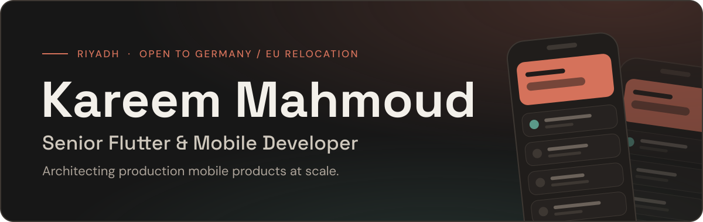

  <picture>
    <source media="(prefers-color-scheme: dark)" srcset="dark_mode.svg" />
    <source media="(prefers-color-scheme: light)" srcset="light_mode.svg" />
    
  </picture>

---

<h1 align="center">Kareem Mahmoud</h1>

<h3 align="center">
Senior Flutter Developer • Mobile Application Engineer
</h3>

Building scalable mobile applications for Android & iOS with Flutter

  
  
  

---

## 🚀 About Me

Senior Flutter Developer with 5+ years of experience delivering
enterprise-grade mobile applications for Android and iOS.

I specialize in:

- Flutter & Dart
- Clean Architecture
- Riverpod, BLoC, Cubit & Provider
- REST APIs & Firebase
- Mobile Performance Optimization
- App Security
- CI/CD Pipelines
- App Store & Google Play Publishing
- Native iOS Development with Swift

Currently building and maintaining large-scale applications serving
thousands and millions of users across logistics, fuel services,
e-commerce, automotive marketplaces, and Islamic platforms.

---

## 📱 Featured Applications

### 🚛 WAIE

Enterprise logistics and fuel services platform developed for Aldrees.

### 🏠 Homemark

Home Services Marketplace connecting customers with service providers.

### 🚗 Wash Slender

Automotive marketplace with real-time communication and vendor management.

### 🕌 Yaqeen

Islamic application including Quran, Prayer Times, Azkar, Qibla Compass,
Mosque Finder, Hadith Collection and Hijri Calendar.

---

## 🛠️ Tech Stack

---

## 📊 GitHub Activity

  
  

---

## 🌍 Let's Connect

---

⭐ Building scalable mobile experiences with Flutter.

