  

  
  
  

  I architect and ship production mobile apps for Android and iOS with Flutter, 
  backed by working capability in native Android (Kotlin / Java) and native iOS (Swift).

<table>
  <tr>
    <td align="center" width="33%"><h3>100K+</h3>Google Play downloads WAIE super-app</td>
    <td align="center" width="33%"><h3>4.7 / 5</h3>store rating from 11K+ ratings</td>
    <td align="center" width="33%"><h3>3+ yrs</h3>shipping Flutter to production</td>
  </tr>
</table>

  

## About

Senior Flutter Developer at **Aldrees Petroleum & Transport Services** in Riyadh. I architected and scaled **WAIE**, the Aldrees logistics and fuel-services super-app, to 100K+ downloads on Google Play and a 4.7/5 rating from 11K+ ratings across both stores — including ERP-integrated enterprise modules and NFC-based transaction workflows.

- **Architecture that lasts** — Clean Architecture, SOLID and BLoC / Cubit / Riverpod, so modules stay maintainable, testable and scalable.
- **Enterprise integration** — ERP-connected driver, technician and attendance apps, integrated over RESTful APIs.
- **Real-time systems** — Dart Streams, WebSockets and gRPC streaming for live chat, tracking and notifications.
- **Payments & hardware** — NFC field transactions plus Stripe, Paymob and Vodafone Cash gateways.
- **End-to-end delivery** — from requirements to App Store and Google Play release, with CI/CD and bilingual Arabic (RTL) / English UI.

## Featured apps

<table>
  <tr>
    <td width="50%" valign="top">
      <h3>WAIE</h3>
      <b>LOGISTICS &amp; FUEL SERVICES SUPER-APP · ALDREES</b>
      
Fuel ordering, real-time logistics tracking and fleet management for individual and enterprise customers across Saudi Arabia. ERP-integrated Driver Dashboard, Technician and Employee Attendance apps with NFC-enabled field transactions. I own the mobile architecture end-to-end.

      
<code>Flutter</code> <code>BLoC / Cubit</code> <code>Clean Architecture</code> <code>REST</code> <code>NFC</code> <code>Firebase</code>

      
      
    </td>
    <td width="50%" valign="top">
      <h3>Wash Slender</h3>
      <b>AUTOMOTIVE MARKETPLACE</b>
      
Bilingual (Arabic RTL / English) marketplace connecting auto-parts merchants and workshops with vehicle owners: listings, live chat, ratings, subscriptions and ad management. Real-time messaging over WebSockets (Laravel Reverb / Pusher).

      
<code>Flutter</code> <code>BLoC / Cubit</code> <code>WebSockets</code> <code>Laravel Reverb</code> <code>Firebase</code>

      
      
    </td>
  </tr>
  <tr>
    <td width="50%" valign="top">
      <h3>Yaqeen</h3>
      <b>ISLAMIC MOBILE APPLICATION</b>
      
Quran reader with audio playback, Azkar, prayer times, prayer streak tracker, Qibla compass, mosque map and Hijri calendar. Feature-based Riverpod + GetIt architecture, with install size reduced through on-demand audio loading.

      
<code>Flutter</code> <code>Riverpod</code> <code>GetIt</code> <code>FCM</code> <code>OpenStreetMap</code>

      
      
      
    </td>
    <td width="50%" valign="top">
      <h3>Homemark</h3>
      <b>HOME SERVICES MARKETPLACE</b>
      
Bilingual (Arabic RTL / English) marketplace connecting customers with verified service providers: discovery, scheduling, tracking and ratings, plus a vendor side with profile, availability, bookings and an earnings dashboard.

      
<code>Flutter</code> <code>BLoC / Cubit</code> <code>REST</code> <code>Firebase</code> <code>GetIt</code>

      
      
    </td>
  </tr>
  <tr>
    <td width="50%" valign="top">
      <h3>Medmacs</h3>
      <b>MEDICAL EDUCATION PLATFORM</b>
      
Learning platform for MBBS students in Pakistan: a 50,000+ MCQ question bank with explained answers, an AI study partner, adaptive tests and full-length exam papers, a real-time Battle Arena for MCQ challenges, and subject-wise performance analytics.

      
<code>Flutter</code> <code>BLoC / Cubit</code> <code>REST</code> <code>Firebase</code>

      
    </td>
    <td width="50%" valign="top"></td>
  </tr>
</table>

## Tech stack

  

| Area | Tools |
| :-- | :-- |
| **Mobile** | Flutter, Dart, native iOS (Swift), native Android (Kotlin, Java) |
| **Architecture** | Clean Architecture, MVVM, SOLID, Repository pattern, dependency injection |
| **State management** | BLoC, Cubit, Riverpod, Provider, GetX |
| **APIs & real-time** | RESTful APIs, gRPC (Protocol Buffers, streaming), Dio, WebSockets, Dart Streams, RxDart |
| **Data & Firebase** | Firestore, Authentication, Cloud Messaging, Analytics, SQLite, Hive |
| **Payments & hardware** | Stripe, Paymob, Vodafone Cash, NFC-based transactions |
| **Delivery** | Git, CI/CD, App Store Connect, Google Play Console, Figma, Postman |

## Experience

| | Role | Highlights |
| :-- | :-- | :-- |
| **2025 – now** | **Senior Flutter Developer** Aldrees Petroleum & Transport Services · Riyadh | Architected and scaled WAIE; built ERP-integrated driver, technician and attendance apps with NFC workflows. |
| **2026** | **Mobile Application Developer** Freelance · Remote | Delivered Homemark and Wash Slender end-to-end as sole developer, through to store release. |
| **2024** | **Mobile Application Developer** NG-Technology · Cairo (remote) | Built a 35+ screen e-commerce app and admin dashboard; integrated three payment gateways. |
| **2023 – 2024** | **Flutter Developer** Ebuziness · Canada (remote) | Developed iBus Carrier Admin, a fleet-management app with route planning, trip scheduling and real-time notifications. |

## Open source

- [**localforge**](https://github.com/KareemTantawi8/localforge) — localization automation toolkit for Flutter.
- [**yaqeen_app**](https://github.com/KareemTantawi8/yaqeen_app) — the Yaqeen Islamic companion app: Quran, Azkar, prayer times and Qibla.
- [**candy_puzzle**](https://github.com/KareemTantawi8/candy_puzzle) — match-3 puzzle game built with Flutter, with 30 levels and progress tracking.

## Background

**B.Sc. Computer Science** — Asyut University, Egypt (GPA 3.4 / 4.0) 
**Languages** — Arabic (native) · English (fluent) · German (A2, in progress)

## Get in touch

Based in Riyadh and open to relocation to Germany / EU. The fastest way to reach me is [email](mailto:kareem01229526319@gmail.com) or [LinkedIn](https://www.linkedin.com/in/kareem-mahmoud-a50822218/); the full CV is on my [portfolio](https://kareem-mahmoud.lovable.app/).
